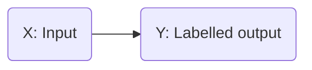
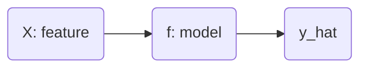

# What is Machine Learning?
- A field of study that gives computers the ability to learn without explicitly programmed

# Algorithms
- Supervised Learning
- Unsupervised Learning
- Recommended Systems
- Reinforcement Learning

# Supervised Learning

- Learns from begin given "right answers".
## Examples
| Input (X) | Output | Application |
| ---------- | -------| -----------|
| Email | Spam (0/1) | Spam Filtering| 
| Audio| Text transcripts | Speed Recognition|
| English | Spanish | Translate |
| Ad, User info | Click? | Online Ad |
| Image / Radar | Position of other cars | Self-Driving Cars |
| Image | Defect in a product | Visual |

## Regression
- Predict a number infinitely many possible outputs
- Example: Predicting house prices. Price v/s House Size graph

## Classification
- Making classes / categories
- Predict categories
- Two or more inputs
- Example: Breast Cancer Detection: Malignant (1) or Benign (0)
- Age v/s Tumor Size graph

# Unsupervised Learning
- Find something interesting in unlabeled data
- Clustering. Example: DNA sequences of people
- Takes data without labels and tries to automatically group them into clusters
- Find structure in data
  
## Clustering
- Group similar data points together

## Anomaly Detection
- Find unused data points

## Dimensionality Reduction
- Compress data using fewer numbers

# Linear Regression
- Fit a Line
- Training Set: Data to train
- $(x^{(i)},y^{(i)})$ = i th training example
- x: input features
- y: output (targets)

- $\hat{y}$ is the predicted value by model and is an estimate of the target `y`.

## Representing model 'f'
- $f_{w,b} = w * x + b$ or $f(x) = w * x + b$
- This is Linear Regression with one variable (univariate)
- w: weight
- b: bias

## Cost Function
- Estimate : ${\hat{y}}^{(i)} = f_{w,b}(x^{(i)})$
- $f_{w,b}(x^{(i)} = w * x^{(i)} + b$
- Cost Function: $J(w,b) = \frac{1}{2m} * \sum_{i=1}^{m} (f_{w,b}(x^{(i)}) - y^{(i)})^2$  is also called the squared error cost function.
- Our goal is to minimize `J(w,b)`
- `J(w,b)` will be a 3D curve.
- `J(w)` for `b=0` will be a parabola.
- `b` v/s `w` graph will be a family of ellipses. Each ellipse is having a constant cost throughout. This graph is very similar to contours on a mountain.
- At the very center of the family of ellipses, the cost is the lowest.

# Gradient Descent
- For any function in general
- Start with some w and b
- Keep changing to reduce `J`
- Repeat until minimum is reached
- `For linear regression of squared error cost function, we always end up with a bowl shape`.
- For different w and b, when we apply the gradient descent, we may end up on totally different valleys.
- Repeat:
- $w = w - \alpha * \frac{\partial J(w,b)}{\partial w}$
- $b = b - \alpha * \frac{\partial J(w,b)}{\partial b}$
- If $\alpha$ is too small: Gradient descent will work, but it will be slow.
- If $\alpha$ is too large: Gradient descent will overshoot and never reach minimum. Fail to converge.
- `We can reach local minimum with fixed learning rates. Gradient descent will automatically take smaller steps.`

# ALL EQUATIONS
## Linear regression model:
- $f_{w,b}(w, b) = w * x + b$

## Cost Function:
- $J(w, b) = \frac{1}{2m} * \sum_{i=1}^{m} (f_{w,b}(x^{(i)}) - y^{(i)})^2$

## Gradient Descent Algorithm
- Repeat till convergence:
- $w = w - \alpha * \frac{\partial J(w,b)}{\partial w}$
- where $\frac{\partial J(w,b)}{\partial w} = \frac{1}{m} * \sum_{i=1}^{m} (f_{w,b}(x^{(i)}) - y^{(i)}) * x^{(i)}$ 
- $b = b - \alpha * \frac{\partial J(w,b)}{\partial b}$
- where $\frac{\partial J(w,b)}{\partial b} = \frac{1}{m} * \sum_{i=1}^{m} (f_{w,b}(x^{(i)}) - y^{(i)})$

- `for a squared error cost function => bowl shape. There is just one minimum.`
- "Batch" GD => Each step of GD used all training examples

# MULTIPLE LINEAR REGRESSION
- $X_{j} = j^{th} feature$
- `n = no of features`
- ${\vec{X}}^{(i)}$ = features of ith training example (raw vector).
- ${X_{j}}^{(i)}$ = features of $i^{th}$ training example
- $f_{w,b}$ = 0.1 * x1 + 4 * x2 + 10 * x3 - 2 * x4 + 80
- x1 = size, x2 = bed, x3 = floors, x4 = years, 80 = base price
- This is multiple linear regression not, multivariable regression.
- $f_{\vec{w}, b}(\vec{x}) = \vec{w} * \vec{x} + b$

# VECTORIZATION
- Numpy is awesome for it
- For n features, instead of one `w`, there will be $w_{j}$ where j = 1, 2.... n
- We have to update each one of them

# An alternative to GD
## Normal Equation
- Only for linear regression
- Solve for w, b without iterations
## Disadvantages
- Doesn't generalize to other learning algorithms
- Slow when n is large
## Note
- NE method may be used in ML libraries that implement linear regression
- GD is the recommended method for finding parameters w, b

# Feature Scaling
- Feature size v/s parameter size ( x v/s w )
- If x is too large, w has to be small
- In general, if $x_{j}$ if big, $w_{j}$ will be small and vice versa
## Mean Normalization
- $x_{1} = \frac{x_{1} - \mu_{1}}{max - min}$
- Same goes with other features too

## z-score Normalization
- We have standard deviation: $\sigma$
- $x_{1} = \frac{x_{1} - \mu_{1}}{\sigma_{1}}$ and same goes with other features.
- Generally, aim for about -1 $\leq$ $x_{j}$ $\leq$ 1

# Making sure GD is working correclty
- Objective: minimize $J(\vec{w}, b)$
- We have learning curve: $J(\vec{w}, b)$ v/x iteration will be like decreasing exponential curve. Cost should keep decreasing
## Identifying problems with GD
- If $\alpha$ is too big, the cost `J` will keep increasing with more and more iterations

# Feature Engineering
- $f_{\vec{w}, b}(\vec{x}) = w_{1} * x_{1} + w_{2} * x_{2} + b$
- Use intuition to desing new features by transforming or combining features
- $x_{3} = x_{1} * x_{2}$: Area = frontage x depth

# Polynomial Regression
- Using higher powers of `x`
- $f_{\vec{w}, b}(\vec{x}) = w_{1} * x + w_{2} * x^{2} + b$
- $f_{\vec{w}, b}(\vec{x}) = w_{1} * x + w_{2} * x^{2} +  w_{3} * x^{3} +b$
- Here, Feature Scaling becomes important.
- If x3 is is big, its cube will be huge, so w3 should be very small.
- Lets try $\sqrt{x}$:
- $f_{\vec{w}, b}(\vec{x}) = w_{1} * x + w_{2} * \sqrt{x} + b$

# CLASSIFICATION
- Binary: 1 or 0
## Sigmoid Function
- $g(z) = \frac{1}{1+e^{-z}}$
- $z = \vec{w} * \vec{x} + b$
- $f_{\vec{w}, b}(\vec{x}) = g(z) = \frac{1}{e^{-(\vec{w} * \vec{x} + b)}}$
- `Gives probability that classification is 0 or 1
- Ex: $f_{\vec{w}, b}(\vec{x})$ = 0.7, then there is a 70% chance that y is 1

## Decision Boundary
- $z = \vec{w} * \vec{x} + b = 0$ is the general equation

## Squared Error Cost
- $J(w,b) = \frac{1}{m} * \sum_{i=1}^{m} \frac{1}{2} * (f_{w,b}(x^{(i)}) - y^{(i)})^2$
- Replace $\frac{1}{2} * (f_{w,b}(x^{(i)}) - y^{(i)})^2$ with $L(f_{\vec{w}, b}(\vec{x}^{(i)}), y^{(i)})$

## Logistic Loss Function
- L(f, y) = -ylog(f) - (1-y)log(1-f)
- $J(w,b) = \frac{1}{m} * \sum_{i=1}^{m} L(f,y)$
- $J(w,b) = \frac{-1}{m} * \sum_{i=1}^{m} (y*log(f) + (1-y)*log(1-f)$

## Gradient Descent
- Repeat till convergence:
- $w = w - \alpha * \frac{\partial J(w,b)}{\partial w}$
- where $\frac{\partial J(w,b)}{\partial w} = \frac{1}{m} * \sum_{i=1}^{m} (f_{w,b}(x^{(i)}) - y^{(i)}) * x^{(i)}$ 
- $b = b - \alpha * \frac{\partial J(w,b)}{\partial b}$
- where $\frac{\partial J(w,b)}{\partial b} = \frac{1}{m} * \sum_{i=1}^{m} (f_{w,b}(x^{(i)}) - y^{(i)})$
- Looks exactly like linear regression equations, but remember, `f` has different definition here.

# OVERFITTING
- Underfit : High Bias
- Overfit: High Variance (doesn't generalize will to new examples)
- Just Right: Pretty good fit and generalizes well

## Solution
- Collect more training examples
- Select features to include or exclude
- Regularization-> reduce sizze of parameters $w_{j}$
- Larger values of $w_{j}$ will lead to overfitting

## Modified Equation
- $J(w,b) = \frac{1}{2m} * \sum_{i=1}^{m} (f_{w,b}(x^{(i)}) - y^{(i)})^2 + \frac{\lambda}{2m} \sum_{i=1}^{m} w_{j}^{2}$
- Where $\lambda$ is the regularization parameter
- $\lambda$ balances both goals: 1) fit data and 2) keep wj small

## Regularized Linear Regression derivatives
- $\frac{\partial J(w,b)}{\partial w} = \frac{1}{m} * \sum_{i=1}^{m} (f_{w,b}(x^{(i)}) - y^{(i)}) * x^{(i)}+ \frac{\lambda}{2m} * w_{j}$
- $\frac{\partial J(w,b)}{\partial w} = \frac{1}{m} * \sum_{i=1}^{m} (f_{w,b}(x^{(i)}) - y^{(i)})$

## Gradient Descent
- $w_{j} = w_{j} - \alpha * (\frac{1}{m} * \sum_{i=1}^{m} (f_{w,b}(x^{(i)}) - y^{(i)}) * x^{(i)}+ \frac{\lambda}{2m} * w_{j})$
- $b = b - \alpha * (\frac{1}{m} * \sum_{i=1}^{m} (f_{w,b}(x^{(i)}) - y^{(i)}))$

## Regularized Logistic Regression
- $J(w,b) = \frac{-1}{m} * \sum_{i=1}^{m} (y*log(f) + (1-y)*log(1-f) + \frac{\lambda}{2m} * \sum_{i=1}^{m} w_{j}^{2}$
