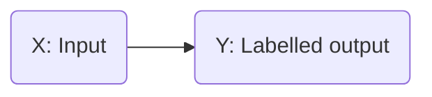

# What is Machine Learning?
- A field of study that gives computers the ability to learn without explicitly programmed

# Algorithms
- Supervised Learning
- Unsupervised Learning
- Recommended Systems
- Reinforcement Learning

# Supervised Learning

- Learns from begin given "right answers".
## Examples
| Input (X) | Output | Application |
| ---------- | -------| -----------|
| Email | Spam (0/1) | Spam Filtering| 
| Audio| Text transcripts | Speed Recognition|
| English | Spanish | Translate |
| Ad, User info | Click? | Online Ad |
| Image / Radar | Position of other cars | Self-Driving Cars |
| Image | Defect in a product | Visual |

## Regression
- Predict a number infinitely many possible outputs
- Example: Predicting house prices. Price v/s House Size graph

## Classification
- Making classes / categories
- Predict categories
- Two or more inputs
- Example: Breast Cancer Detection: Malignant (1) or Benign (0)
- Age v/s Tumor Size graph

# Unsupervised Learning
- Find something interesting in unlabeled data
- Clustering. Example: DNA sequences of people
- Takes data without labels and tries to automatically group them into clusters
- Find structure in data
  
## Clustering
- Group similar data points together

## Anomaly Detection
- Find unused data points

## Dimensionality Reduction
- Compress data using fewer numbers

# Linear Regression
- Fit a Line
- Training Set: Data to train
- $(x^{(i)},y^{(i)})$ = i th training example
- x: input features
- y: output (targets)

- $\hat{y}$ is the predicted value by model and is an estimate of the target `y`.

## Representing model 'f'
- $f_{w,b} = w * x + b$ or $f(x) = w * x + b$
- This is Linear Regression with one variable (univariate)
- w: weight
- b: bias

## Cost Function

- 
