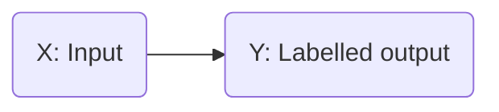
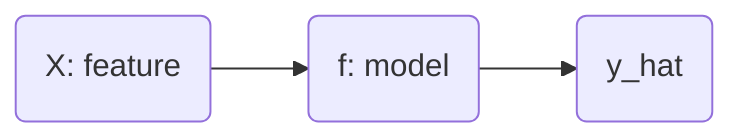

# What is Machine Learning?
- A field of study that gives computers the ability to learn without explicitly programmed

# Algorithms
- Supervised Learning
- Unsupervised Learning
- Recommended Systems
- Reinforcement Learning

# Supervised Learning

- Learns from begin given "right answers".
## Examples
| Input (X) | Output | Application |
| ---------- | -------| -----------|
| Email | Spam (0/1) | Spam Filtering| 
| Audio| Text transcripts | Speed Recognition|
| English | Spanish | Translate |
| Ad, User info | Click? | Online Ad |
| Image / Radar | Position of other cars | Self-Driving Cars |
| Image | Defect in a product | Visual |

## Regression
- Predict a number infinitely many possible outputs
- Example: Predicting house prices. Price v/s House Size graph

## Classification
- Making classes / categories
- Predict categories
- Two or more inputs
- Example: Breast Cancer Detection: Malignant (1) or Benign (0)
- Age v/s Tumor Size graph

# Unsupervised Learning
- Find something interesting in unlabeled data
- Clustering. Example: DNA sequences of people
- Takes data without labels and tries to automatically group them into clusters
- Find structure in data
  
## Clustering
- Group similar data points together

## Anomaly Detection
- Find unused data points

## Dimensionality Reduction
- Compress data using fewer numbers

# Linear Regression
- Fit a Line
- Training Set: Data to train
- $(x^{(i)},y^{(i)})$ = i th training example
- x: input features
- y: output (targets)

- $\hat{y}$ is the predicted value by model and is an estimate of the target `y`.

## Representing model 'f'
- $f_{w,b} = w * x + b$ or $f(x) = w * x + b$
- This is Linear Regression with one variable (univariate)
- w: weight
- b: bias

## Cost Function
- Estimate : ${\hat{y}}^{(i)} = f_{w,b}(x^{(i)})$
- $f_{w,b}(x^{(i)} = w * x^{(i)} + b$
- Cost Function: $J(w,b) = \frac{1}{2m} * \sum_{i=1}^{m} (f_{w,b}(x^{(i)}) - y^{(i)})^2$  is also called the squared error cost function.
- Our goal is to minimize `J(w,b)`
- `J(w,b)` will be a 3D curve.
- `J(w)` for `b=0` will be a parabola.
- `b` v/s `w` graph will be a family of ellipses. Each ellipse is having a constant cost throughout. This graph is very similar to contours on a mountain.
- At the very center of the family of ellipses, the cost is the lowest.

# Gradient Descent
- For any function in general
- Start with some w and b
- Keep changing to reduce `J`
- Repeat until minimum is reached
- `For linear regression of squared error cost function, we always end up with a bowl shape`.
- For different w and b, when we apply the gradient descent, we may end up on totally different valleys.
- Repeat:
- $w = w - \alpha * \frac{\partial J(w,b)}{\partial w}$
- $b = b - \alpha * \frac{\partial J(w,b)}{\partial b}$
- If $\alpha$ is too small: Gradient descent will work, but it will be slow.
- If $\alpha$ is too large: Gradient descent will overshoot and never reach minimum. Fail to converge.
- `We can reach local minimum with fixed learning rates. Gradient descent will automatically take smaller steps.`

# ALL EQUATIONS
## Linear regression model:
- $f_{w,b}(w, b) = w * x + b$

## Cost Function:
- $J(w, b) = \frac{1}{2m} * \sum_{i=1}^{m} (f_{w,b}(x^{(i)}) - y^{(i)})^2$

## Gradient Descent Algorithm
- Repeat till convergence:
- $w = w - \alpha * \frac{\partial J(w,b)}{\partial w}$
- where $\frac{\partial J(w,b)}{\partial w} = \frac{1}{m} * \sum_{i=1}^{m} (f_{w,b}(x^{(i)}) - y^{(i)}) * x^{(i)}$ 
- $b = b - \alpha * \frac{\partial J(w,b)}{\partial b}$
- where $\frac{\partial J(w,b)}{\partial b} = \frac{1}{m} * \sum_{i=1}^{m} (f_{w,b}(x^{(i)}) - y^{(i)})$

- `for a squared error cost function => bowl shape. There is just one minimum.`
- "Batch" GD => Each step of GD used all training examples

# MULTIPLE LINEAR REGRESSION
- 
