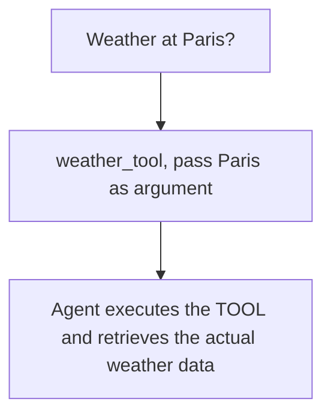
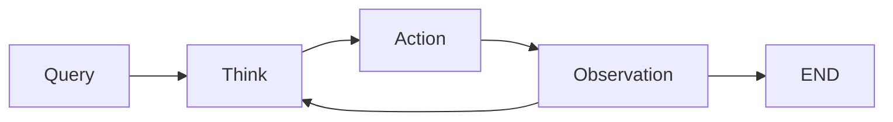

# [AI Agents](https://huggingface.co/learn/agents-course/unit0/introduction)

## Course Structure
- Understanding Agents
- Role of LLMs in Agents
- Tools and Actions
- Agentic Workflow
- Code your first agent
- Publish it on HF spaces

# What is an Agent?
- An agent is a system that leverages an AI model to interact with its environment in order to achieve a user-defined objective. It combines reasoning, planning, and the execution of actions to fulfill tasks.
- User Input -> Reason -> Plan -> Execute with tools

## Two main parts of an Agent

### 1) The Brain (AI Model)
- The thinking happens here.
- The model handles reasoning and planning.
- It decides which **actions** to take based on situation.

## 2) The Body (Tools and Capabilities)
- Everything the Agent is equipped to do.
- The scope of possible actions depends on what the agent has been equipped with.

## Types of Agents
- Simple Processor: Agent o/p has no impact on program flow
- Router: Determines basic control flow
- Tool Caller: Determines function execution
- Multistep agent: Controls iteration and program continuation
- Multi-agent: One agentic workflow can start another agentic workflow
- Code Agent: LLM acts in code, can define its own tools / start other agents

## Extras
- AI agents are programs where LLM outputs control the workflow
- Most common AI models are: Text as input -> Text as ouput
- The design of tools is very Important and has a great impact on the quality of your agent
- Actions != Tools
- Actions use multiple tools for executing a task

### Personal Virtue Assistants
- Siri, Alexa
- Take user queries, analyze context, retrieve info from databases, provide responses or initiate actions

### Customer Service Chatbots
- Troubleshoot, open issues, or complete transactions

### AI Non-Playable Characters in a video game
- More lifelike characters

# Large Language Models (LLMs)
- Type of AI model that excels at understanding and generating human language
- Most of them are built on Transformer Architecture based on "Attention" Algorithm
- [Attention is all you need](https://arxiv.org/pdf/1706.03762)

## Types of Transformers
### 1) Encoders
- Text as input
- Outputs a dense representation of text
- Classify text, sematic search, named entity recognition
- Millions of parameter
- Ex: BERT from Google

### Decoders
- Focuses on generating new tokens to complete a squence, one token at a time.
- Llama
- Chatbots, Text Generator, Code Generator
- Billions of Parameters

### Seq2Seq (enc-dec)
- Combines encoder and decoder
- Encoder processes input sequences to a context representation
- Decoder generates an output sequence
- Translation, summarization and paraphrasing
- Millions of parameters

#### Principle of LLMs: Predict the next token, given a sequence of previous tokens
- Token is a unit of information: sub-word units
- Each LLM has special tokens specific to the model.
- The LLM uses tokens to open and close the structured components of its generation.

## Token Prediction
- LLMs are auto-regressive. Output from one pass becomes input for the next one.
- LLM will decode text until it reaches EOS (end of sequence)
- Once input text is tokenized, the model computes a representation of sequence that captures info about meaning and position of each token in input sequence.
- This representation goes into model, probabilities are assigned to each token in its vocabulary.
- Highest -> choost it.

## Beam Search Visualizer
- Explores multiple candidate sequences to find the one with maximum total score even if some individual tokens have lower scores
### Parameters
- Sentence to decode from (input)
- Number of steps
- Number of beams
- Length of penalty. `> 0.0` will promote long sequences and `< 0.0` will promote shorter ones.
- Number of return sequences -> to be returned at end of generation should be <= num_beams

## Attention is all you need
- Key aspect of Transformer architecture is Attention. While predicting next word, not every word in a sentence is equally important.
- Ex: "The <ins>capital</ins> of <ins>France</ins> is ...". `capital` and 'France` hold the most meaning.
- Context Length: Max number of tokens the LLM can process, and the max attention span it has.

## How can you use LLMs?
- Run locally
- Use a cloud/API (HF Serverless interface API)

## Messages and Special Tokens
- Exchanging messages.

### System Messages
- Define how the model should behave.
- `You are a professional customer service agent. Always be polite, clear and helpful.`
- Also gives info about the available tools, provides instructions to model on how to format the actions to take and includes guidelines on how the thought process should be segmented.
- Chat Templates help maintain context by preserving conversation history, storing previous exchanges between user and assistant.
- Concatenate all the messages in conversation and pass it on to LLM as single-stand-alone sequence.

### Chat Templates
- Essential for structuring conversations between language models and users.

### Base Model
- Trained on raw text data to predict the next token.

### Instruct Model
- Fine-tuned specifically to follow instructions and engage in conversations.
- To make a base model behave like an instruct model, we need to format our prompts in a consistent way that the model can understand.

## What are AI tools?
- A function given to the LLM
- Should fulfill a clear objective
### Examples
- Web Search: fetch up-to-date info
- Image Gen: Based on text
- Retrieval: Return info from external source
- API interface: Interacts with an external API
### Should contain
- Textual description of what the function does
- A callable
- Arguments with typings
- Outputs with typings
- LLM predict completion of prompt based on their training data

### Working
- `Providing tools to an agent: Teaching LLM about existence of these tools and instructing it to generate text-based invocations when needed`

- Agent appends the new message to LLM
- The LLM processes this additional context and generates a natural-sounding response to the user
- We feel as if LLMs interacted with tool, in reality, it was the Agent

## How to give tools to LLM?
- We use system prompt to provide textual description of available tools to model.
- It must include: What the tool does, What exact input it expects
```
ToolName: calculator,
Description: Multiply two integers
Arguments: a: int, b:int,
Outputs: int
```

## Model Context Protocol (MCP)
- An open protocol that standardizes how applications provide tools to LLMs.
### Providers
- Growing list of pre-built integrations that LLM can directly plug into
- Flexibility to swith between LLM providers
- Best practices for securing your data within your infrastructure
- Any framework implementing MCP can leverage tools defined the need to reimplement same tool interface for each framework

## AGENTIC WORKFLOW
### Core Components
1) Thought: The LLM decides what next step should be.
2) Action: The agent takes an action, by calling the tools with the associated arguments.
3) Observation: Model reflects on response from tool.
- All in Continuous loop:

- These rules are embedded into the system prompt.

### Example

#### 1. Query
- "What is the current weather in New York?"

#### 2. Though
- The user need to know the current weather in New York
- I have access to a tool that fetches weather data
- First, call the weather API

#### 3. Action
- Alfred prepares a JSON-formatted command that calls the weather API tool.

#### 4. Observation
- After the tool call, Alfred receives an observation.

#### 5. Updated Though
- Now that I have weather data, I can compile an answer for the user

#### 6. Final Action
- Response formatting

### THOUGHT
- Agent's internal reasoning and planning processes
#### Types
- Planning
- Analysis
- Decision Making
- Problem Statement
- Memory Integration
- Self-reflection
- Goal Setting
- Prioritization

## The ReAct approach
- Reasoning + Acting
- "Let's think step-by-step" before LLM decodes next tokens.
- The model is encouraged to decompose problem into sub-tasks.

### ACTION

#### Types of Agents
1) JSON Agent: Action specified in JSON format
2) Code Agent: Writes code block
3) Function Calling Agent: Generate a new message for each action

#### Types of Actions
1) Information Gathering
2) Tool Usage
3) Environment Interaction
4) Communication

- For an agent to work properly, the LLM must STOP generating new tokwns after emitting all tokens to define a complete action
- This passes control back to agent to ensure result is parseable to JSON, code or function calling

## Stop and Parse Approach
1) Generation in Structured Format: Agent outputs its intended action in a clear, pre-determined format
2) Halting Further Generation: Once the text defining the action has been emitted, the LLM stops generating additional tokens. Prevents erraneous output
3) Parsing Output: An external parser reads the formatted action, determines which tool to call, and extracts the required parameters
- This clear, machine-readable formate minimizes errors and enables external tools to accurately process the agents command

## Code Agents
- Generates an executable code block. Ex: Python
### Advantages
- Expressiveness
- Modularity
- Enchanced Debuggability
- Direct Integration

### OBSERVE : Integrate feedback to reflect and adapt
- How AI agent perceives consequences of its actions
#### Steps
1) Collects Feedback: Receives Data
2) Appends Results: Integrates new information into its existing context, updating its memory
3) Adapts its strategy: Uses this updated context to refine subsequent thoughts and actions
- Decide if its ready to provide a final answer or additional information is required
- This iterative incorporation of feedback ensures the agent remains dynamically aligned with its goals, constantly learning and adjusting based on real-world outcomes

#### Types
1) System Feedback: Error messages, success notifications
2) Data Changes: Database updates, file system modifications
3) Env Data: Sensor Readings, System metrics, resource usage
4) Response Analysis: API responses, query results, computation outputs
5) Time-based Events: Deadlines reached, scheduled tasks completed

## Exercise
- Add tools to your first agent using `smolagents`
